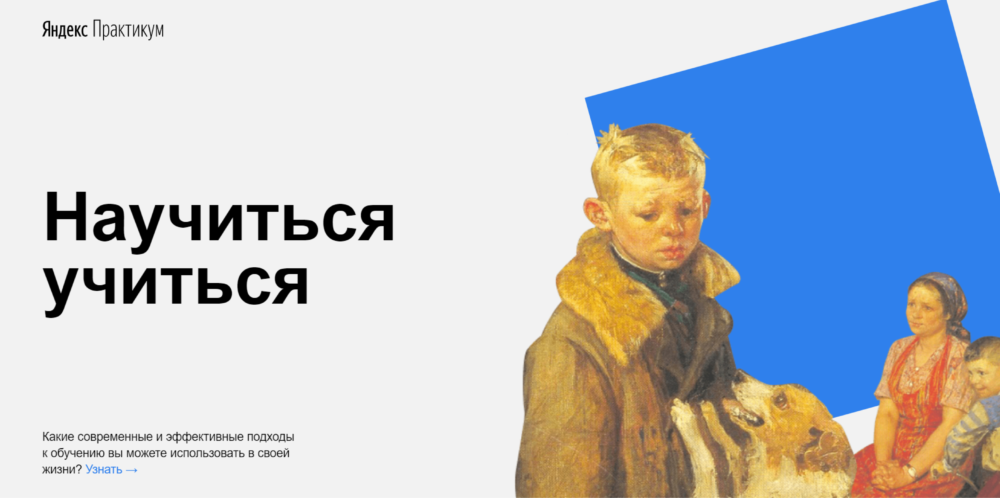

#**Научиться учиться**#

##**Описание проекта:**##
###*Этот проект* помогает грамотно спланировать своё обучение, знакомит с методами,  
помогающими качественному усвоению новых знаний, последовательно и без перегрузок.  
*В этой проектной работе,* в отличие от предыдущей, использовались анимация, трансформация,
вставка видео с помощью iframe. Ссылки стали реагировать на наведение мыши.###